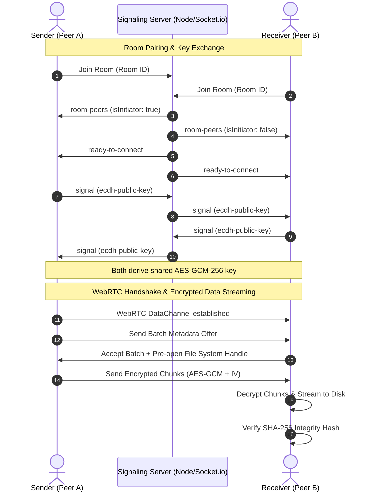

# 🚀 FileShare (LocalDrop) — Zero-Trust P2P File Transfer Engine

[](https.shields.org)
[](https://webrtc.org/)
[](https://developer.mozilla.org/en-US/docs/Web/API/Web_Crypto_API)
[](https://nodejs.org/)

**FileShare (LocalDrop)** is a high-performance, zero-trust, peer-to-peer (P2P) file transfer application built with **WebRTC**, **Web Crypto API**, and **Node.js**. It enables private, high-speed file transfers directly between web browsers with **End-to-End Encryption (E2EE)** and direct disk streaming, completely bypassing third-party storage servers.

---

## ✨ Key Highlights & Technical Accomplishments

* **🔐 Zero-Trust End-to-End Encryption (E2EE)**:
  * Uses ephemeral **ECDH (Elliptic Curve Diffie-Hellman)** key pairs on the **P-256 curve** for secure in-browser key exchange over signaling.
  * Derives a **256-bit AES-GCM** symmetric payload key.
  * Encrypts and decrypts file chunks on-the-fly using unique 12-byte random Initialization Vectors (IVs) per chunk.
* **💾 Direct-to-Disk Streaming (File System Access API)**:
  * Prompts for file save locations synchronously during the user accept gesture.
  * Feeds decrypted chunks directly into pre-opened `FileSystemWritableFileStream` handles, enabling gigabyte-scale transfers without browser memory spikes or RAM exhaustion.
* **⚡ High-Throughput Flow Control (Backpressure Engine)**:
  * Chunking tuned to **64 KB** for optimal WebRTC transport layer performance.
  * Implements dynamic backpressure thresholds (**16 MB high watermark** / **1 MB low watermark**) that automatically throttle and resume streaming based on network capacity.
* **🛡️ Bit-Rot & Tamper Protection**:
  * Calculates **SHA-256 hashes** for all files prior to transmission and verifies integrity upon payload completion.
* **📱 Frictionless Pairing**:
  * 6-digit room codes, instant shareable URL hashes, and dynamic mobile **QR Code** generation.
* **🔄 Resilient Session Handshaking**:
  * Non-blocking socket signaling reconnection that preserves active WebRTC data channels during network blips.

---

## 🏗️ Architecture & Protocol Sequence



---

## 🛠️ Technology Stack

* **Frontend**:
  * Vanilla JavaScript (ES2022+) — Native async processing & event management.
  * **Web Crypto API** (`crypto.subtle`) — Ephemeral ECDH key exchange & AES-GCM encryption.
  * **Native File System Access API** — Direct disk streaming.
  * **Tailwind CSS** — Glassmorphism dark mode UI.
  * **QRCode.js** — Mobile QR pairing generator.
* **Backend**:
  * **Node.js** & **Express** — Static file delivery.
  * **Socket.io** — Lightweight signaling server (zero payload visibility).

---

## 📦 Getting Started

### Prerequisites
* **Node.js**: v18.0.0 or higher
* **npm**: v9.0.0 or higher

### Installation & Execution

1. **Clone the repository**:
   ```bash
   git clone https://github.com/Rohan-756/FileShare.git
   cd FileShare
   ```

2. **Install Server Dependencies**:
   ```bash
   cd server
   npm install
   ```

3. **Launch Local Development Server**:
   ```bash
   npm run dev
   ```

4. **Access the Application**:
   Open your browser to `http://localhost:3000`. Open a second window or mobile device with the generated room link/QR code to test P2P file transfers!

---

## 🔒 Security Threat Model

1. **Zero Server Storage**: The server acts exclusively as a WebSocket signaling broker for WebRTC session negotiation and ECDH public key relaying. No file data or ciphertexts ever pass through the server.
2. **Ephemeral Keys**: Key pairs are generated transiently in memory using Web Crypto API (`window.crypto.subtle`) and are never written to `localStorage`, cookies, or disk.
3. **Chunk-Level Authentication**: AES-GCM provides authenticated encryption, guaranteeing that tampered or corrupted payload chunks fail decryption immediately.

---

## 📄 License
Distributed under the **MIT License**. See `LICENSE` for more information.
