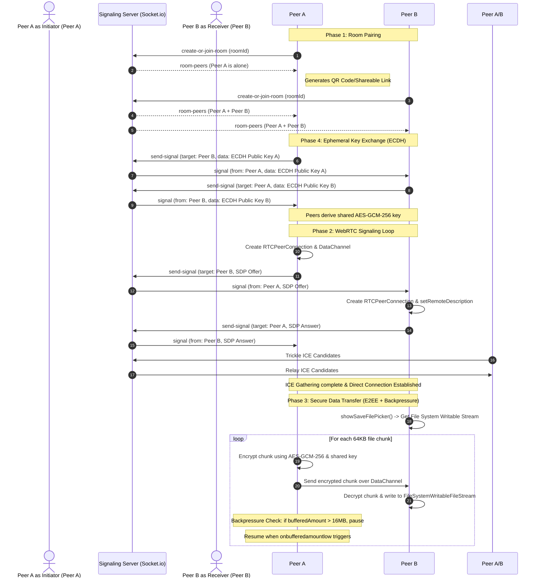

# LocalDrop Global - Zero-Trust P2P File Transfer System
## Architecture & Implementation Plan

LocalDrop Global is a secure, high-performance, web-based peer-to-peer (P2P) file transfer application designed to work across different networks (cellular, home Wi-Fi, corporate networks) without relying on intermediate servers for payload storage.

---

## 🛠️ Tech Stack & Key APIs

| Layer | Component / API | Purpose |
| :--- | :--- | :--- |
| **Backend** | Node.js, Express, Socket.io | Signaling server, static file hosting, peer matchmaking. |
| **P2P Connection**| WebRTC (`RTCPeerConnection`) | P2P communication tunnel bypassing signaling server for data payload. |
| **NAT Traversal** | STUN + TURN | Bypasses symmetric NATs and restrictive firewalls (cellular, office networks). |
| **Security** | Web Crypto API (`ECDH`, `AES-GCM`) | Zero-trust end-to-end encryption. The signaling server never sees the raw content. |
| **Streaming** | Web Streams API (`FileSystemWritableFileStream`)| Stream-to-disk logic preventing RAM bloat or browser crashes on large files. |
| **Flow Control** | RTCDataChannel Buffer Control | Custom sender backpressure using `bufferedAmount` & `bufferedamountlow`. |
| **UI/UX** | Tailwind CSS, QR Code Generation | Elegant, responsive, dark-mode-first visual interface. |

---

## 🏁 Phase-by-Phase Technical Specifications

### Phase 1: Global Signaling Server & Room Pairing
- **Room Pairing Protocol:** 
  - Room IDs will be generated randomly as a 6-digit code (e.g., `582910`) or parsed from the URL hash (e.g., `/#room=abc123xyz`).
  - Joining is instantaneous. The signaling server maintains socket rooms via Socket.io.
  - A WebSocket-based relay handles:
    - User discovery (`room-peers` notification).
    - SDP signaling (`offer`, `answer`).
    - ICE negotiation (`ice-candidate`).
    - ECDH key exchange payloads (`ecdh-public-key`).
- **QR & Sharing Interface:**
  - Dynamic QR code generation on the client-side using `qrcode` or a CDN script.
  - Share button to copy the room's direct connection URL to the clipboard.

### Phase 2: WebRTC & NAT Traversal
- **ICE Server Configuration:**
  - Google's free STUN servers: `stun:stun.l.google.com:19302`.
  - Fallback TURN server credentials integration.
- **Connection Handshake:**
  - Connection is bi-directional but initiated by the peer that was already in the room when the second peer joined.
  - Trickle ICE is fully supported to reduce connection establishment latency.

### Phase 3: Disk Streaming & Backpressure Control
- **Streaming Chunks to Disk:**
  - Use `window.showSaveFilePicker()` to prompt the user for the destination file before the transfer starts.
  - Write chunks to `FileSystemWritableFileStream` as they are decrypted.
  - *Fallback Strategy:* If the browser does not support `showSaveFilePicker()`, we collect chunks into a memory-efficient `Blob` stream or dynamic array and download via a temporary `<a>` element (with warning to the user about memory usage limits on extremely large files).
- **Backpressure Mechanism:**
  - Chunk size: `64 KB` (optimized for RTCDataChannel throughput).
  - High Watermark: `16 MB` (if `bufferedAmount` exceeds this threshold, pause reading/sending).
  - Low Watermark: `1 MB` (resume sending when `bufferedAmount` drops below this threshold).

### Phase 4: Zero-Trust Security (E2EE)
- **Key Exchange (ECDH):**
  - Ephemeral elliptic curve Diffie-Hellman (ECDH) keys using the **P-256** curve.
  - Peers compute the shared secret and derive a **256-bit AES-GCM** key.
- **Payload Encryption:**
  - For each chunk:
    - Generate a fresh, random `12-byte initialization vector (IV)`.
    - Encrypt the chunk using the AES-GCM shared key.
    - Package the IV + encrypted ciphertext together.
    - Send over the RTCDataChannel.
  - Decrypt on receipt and flush straight to disk.

---

## 🚦 Phase 1 Roadmap & Next Steps

Before writing code, let's verify key technical choices:
1. **TURN Servers:** Do you have specific TURN server credentials you'd like to use (e.g., Metered.ca), or should we build in environment variable configurations (`TURN_USERNAME`, `TURN_CREDENTIAL`, `TURN_URL`) so they are easily configured later?
2. **Library Selection:** For QR code rendering in the browser, is using a CDN-delivered lightweight library (like `qrcode.js` or `qrcode.min.js`) acceptable?
3. **Project Initialization:** Once you are ready, I can initialize the repository, install dependencies, and build the Phase 1 server and UI.

Please review the architecture and let me know your thoughts on the approach!
